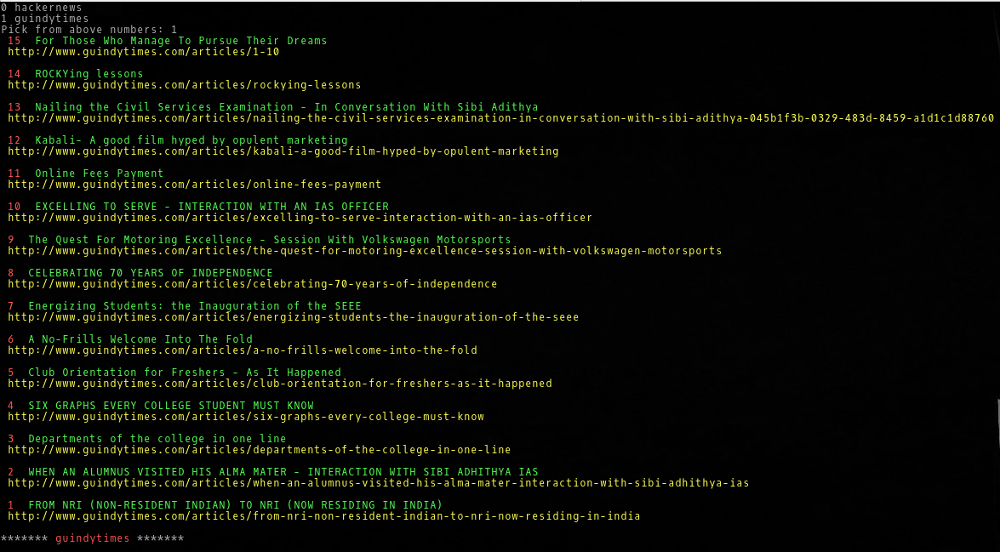

# RSS Reader Command Line Interface

## Preinstallations

$ `sudo apt install curl`

$ `sudo apt install python-pip`

$ `sudo pip install BeautifulSoup4`

## Installing

To download this repository, you may either clone via git:

$ `cd ~`

$ `git clone https://github.com/lost-plus-found/rss-reader-cli`

or download a source code: [rss-reader-cli](https://github.com/lost-plus-found/rss-reader-cli/archive/master.zip).

$ `cd ~/rss-reader-cli`

$ `sudo make install`

## Updating

$ `cd ~/rss-reader-cli`

$ `sudo make update`

## Uninstalling

$ `cd ~/rss-reader-cli`

$ `sudo make uninstall`

## Running the command

To choose from the available feeds
$ `rssreader`

To add new feed to your personal list
$ `rssreader --add`

To read a feed by knowing its number
$ `rssreader 0`

To read a feed with its url
$ `rssreader "http://guindytimes.com/rss?format=rss"`

